# Security Policies and Procedures

- [Supported Versions](#supported-versions)
- [Reporting a Vulnerability](#reporting-a-vulnerability)
- [Disclosure Policy](#disclosure-policy)

## Supported Versions

We release patches, bug fixed and patches for security vulnerabilities.
Which versions are eligible for receiving such patches depend on supported versions:

| Version  | Initial Release | Active Support Until                                   | Security Support Until                                 |
|----------|-----------------|--------------------------------------------------------|--------------------------------------------------------|
| < v1.0.0 | 2024-10-31      | :black_large_square: No support for developer versions | :black_large_square: No support for developer versions |

```mermaid
%%{init: {
  "theme": "default",
  "themeVariables": {
    "textColor" : "#adbac7"
 }
}}%%
gantt
    title Calendar
    section <v1.0.0
    ⬛ DEV (Development)            : active, dev100, 2024-10-31, 1y
    🟦 GA (General availability)    :         ga100, after dev100, 1y
```

### Legend

| Type                                     | Description                                                                                                                                                                                                         |
|------------------------------------------|---------------------------------------------------------------------------------------------------------------------------------------------------------------------------------------------------------------------|
| :blue_square: GA (General availability)  | A release that is being both actively supported and regular releases with new features and enhancements are made. Reported bugs and security issues are fixed and regular point releases are made.                  |
| :green_square: GM (General maintenance)  | A release that is being actively supported, but no new features and enhancements are made. Reported bugs and security issues are fixed and regular point releases are made.                                         |
| :yellow_square: EOS (End of sales)       | A release that is being supported only for critical bugs and security issues. Release is no longer sold to new customers. Reported critical bugs and security issues are fixed and regular point releases are made. |
| :orange_square: EOM (End of maintenance) | A release that is supported for critical security issues only. General support is restricted to investigations, troubleshooting and workarounds. Releases are only made on an as-needed basis.                      |
| :red_square: EOS (End of support)        | A release that is supported for critical security issues only and general support is not available. Releases are only made on an as-needed basis.                                                                   |
| :purple_square: EOL (End of life)        | A release that is no longer supported and general support is not available. Users of this release should upgrade as soon as possible, as they may be exposed to unpatched security vulnerabilities.                 |
| :black_large_square: DEV (Development)   | A release that is only for development purpose. These releases should not be used in production, and don't have any support for them.                                                                               |

## Reporting a Vulnerability

FireHub team will take all security vulnerabilities seriously.
Thank you for improving the security of our open-source software.
We appreciate your efforts and responsible disclosure and will make every effort to acknowledge your contributions.

Report security vulnerabilities by emailing at:
**[danijel.galic@outlook.com](mailto:danijel.galic@outlook.com)**

The lead maintainer will acknowledge your email within 24 hours and will send a more detailed response within 48 hours indicating the next steps in handling your report.
After the initial reply to your report, the security team will endeavor to keep you informed of the progress towards a fix and full announcement and may ask for additional information or guidance.

Report security vulnerabilities in third-party modules to the person or team maintaining the module.

## Disclosure Policy

When the security team receives a security bug report, they will assign it to a primary handler.
This person will coordinate the fix and release process, involving the following steps:

- Confirm the problem and determine the affected versions.
- Audit code to find any potential similar problems.
- Prepare fixes for all releases still under maintenance.
  These fixes will be released as fast as possible to NPM.